Steam game developer, I work with a number of different technologies
such as game engines, automation and embedded systems. 
if you're looking for something specific, see [Vortex Interactive](https://github.com/vortexdevsoftware)

#### Languages

         

Feel free to contact me, if you have something interesting in mind!  - <b>iglx</b>

